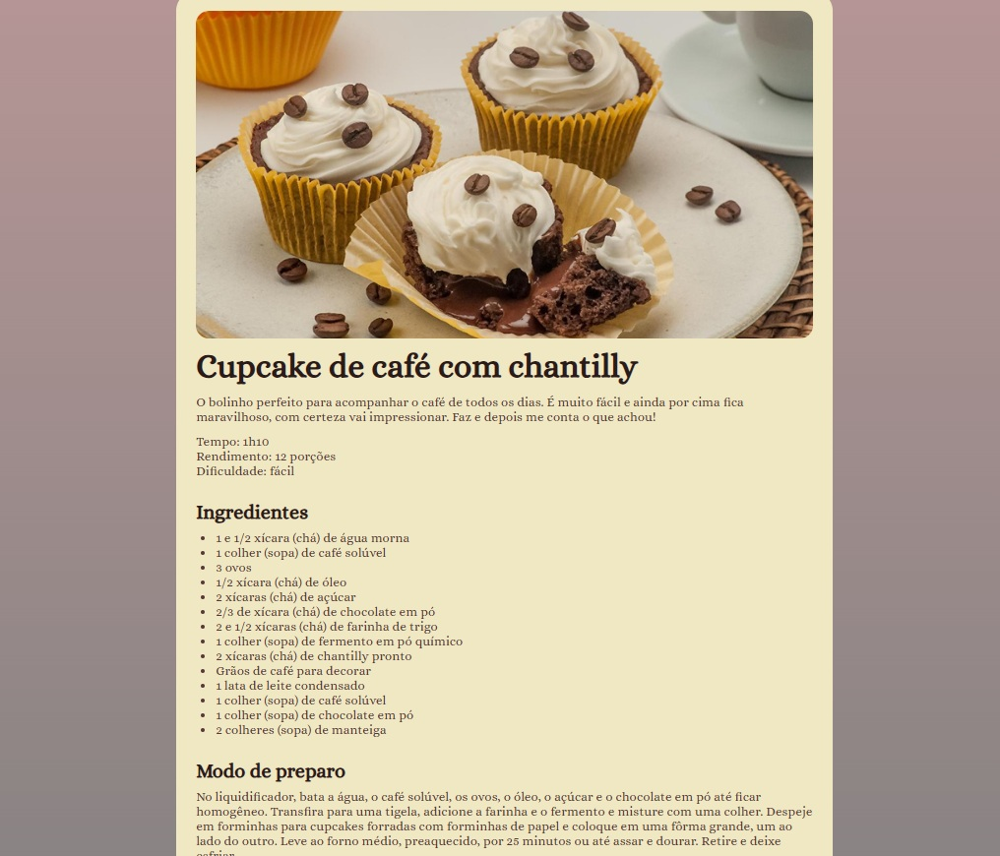

# Página da Receita: Cupcake de Café com Chantilly - Exercício Proposto pela Rocketseat

Este é um projeto simples e responsivo que apresenta uma página web dedicada a uma receita deliciosa de **Cupcake de Café com Chantilly**. O layout foi criado para ser visualmente atraente e fácil de navegar, proporcionando uma experiência agradável ao usuário.

## Estrutura do Projeto

O projeto segue uma estrutura básica de HTML5, contendo as seguintes seções principais:

1. **Cabeçalho (Head)**:

   - Metadados como `charset`, `viewport` e título da página.
   - Importação de fontes externas do Google Fonts (`Alice`) para estilização do texto.
   - Link para o arquivo CSS externo (`style.css`) para estilização personalizada.

2. **Corpo (Body)**:

   - Uma imagem principal (`main-image.jpg`) exibida no topo da página.
   - Seções organizadas em `section` para melhor semântica:
     - **Sobre**: Apresenta o nome da receita, uma breve descrição, tempo de preparo, rendimento e nível de dificuldade.
     - **Ingredientes**: Lista detalhada de todos os ingredientes necessários para a receita.
     - **Modo de Preparo**: Explicação passo a passo de como preparar os cupcakes, incluindo o recheio e a decoração.
   - Um rodapé (`footer`) que credita a criação da página à Rocketseat, com um ícone de coração.

3. **Rodapé (Footer)**:
   - Inclui um pequeno crédito com um ícone de coração (`ph_heart-fill.svg`) para adicionar um toque visual.

## Recursos Utilizados

- **HTML5**: Estrutura semântica para organizar o conteúdo.
- **CSS Externo**: Estilização personalizada via `style.css`.
- **Google Fonts**: Fonte `Alice` usada para dar um toque elegante ao design.
- **Imagens**:
  - `main-image.jpg`: Imagem principal do cupcake decorado com grãos de café.
  - `ph_heart-fill.svg`: Ícone de coração usado no rodapé.

## Como Usar

1. **Pré-requisitos**:

   - Certifique-se de ter um navegador moderno instalado (Google Chrome, Firefox, Safari, etc.).
   - Clone ou baixe este repositório para acessar os arquivos.

2. **Execução**:
   - Abra o arquivo `index.html` no navegador para visualizar a página.
   - Certifique-se de que todos os arquivos de imagem (`assets/main-image.jpg` e `assets/ph_heart-fill.svg`) e o arquivo CSS (`style.css`) estejam no diretório correto para que a página seja renderizada corretamente.

## Personalização

- **Estilo**: Para alterar a aparência da página, edite o arquivo `style.css`. Você pode modificar cores, fontes, espaçamentos e outros elementos visuais.
- **Conteúdo**: Atualize o texto, imagens ou ingredientes no arquivo `index.html` para adaptar a página a outras receitas ou propósitos.
- **Imagens**: Substitua as imagens na pasta `assets` por outras de sua preferência, ajustando os caminhos no HTML conforme necessário.

## Créditos

- **Design e Desenvolvimento**: Este projeto foi inspirado e desenvolvido com base em práticas modernas de desenvolvimento web.
- **Ícones**: O ícone de coração (`ph_heart-fill.svg`) foi gentilmente disponibilizado pela Rocketseat.
- **Fontes**: A fonte `Alice` foi importada do Google Fonts.

## Licença

Este projeto está sob a licença MIT. Sinta-se à vontade para usá-lo, modificá-lo e distribuí-lo conforme suas necessidades.

---

Desenvolvido com ❤️ por Andre Maurell
